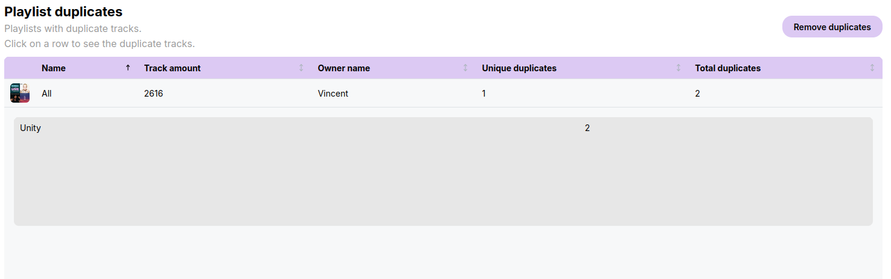
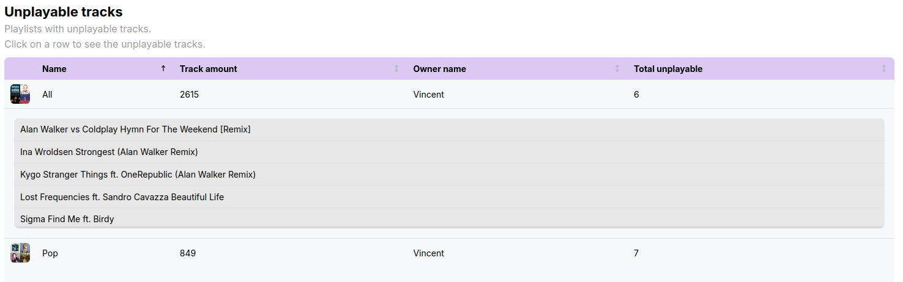
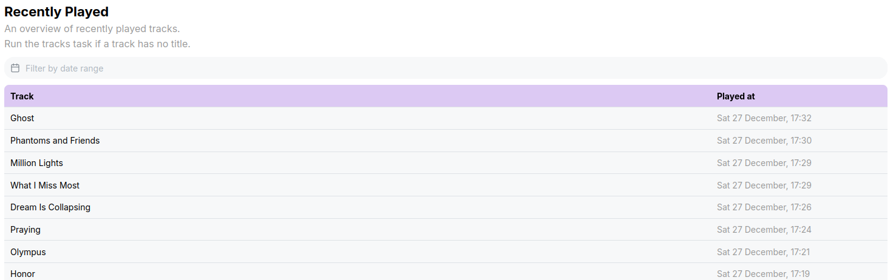
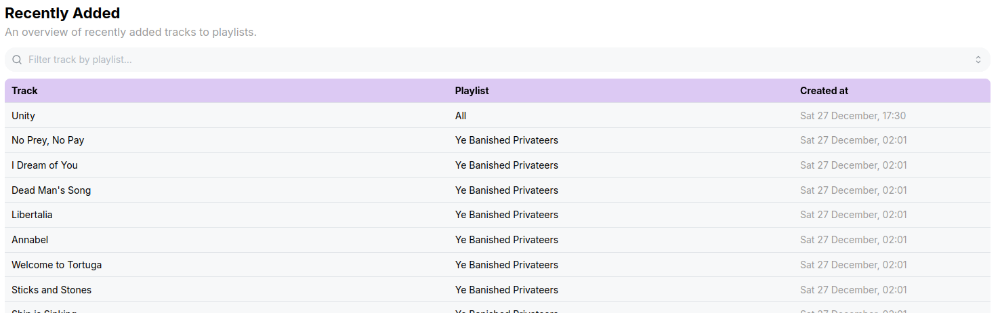
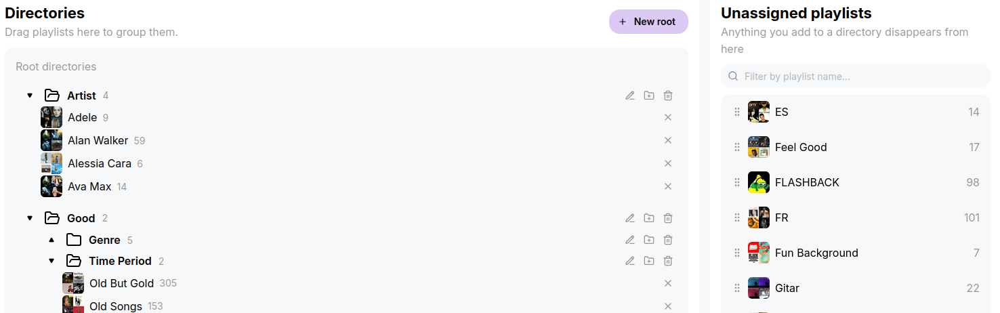
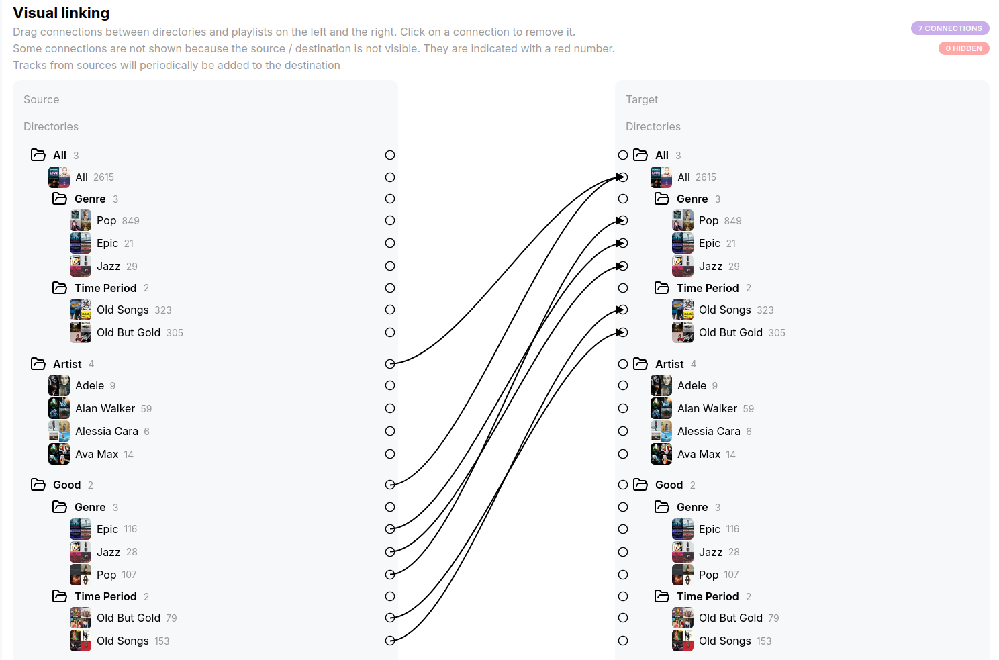

# Sortifyr

A web application to help organize and automate your Spotify playlists.

- Detect duplicate and unavailable tracks in playlists
- Keep track of your all time listening history and playlist changes
- Create one-way synchronized playlists links

## Features

### Playlists

<details>
  <summary>Duplicate tracks</summary>

  Find any duplicate track in a playlist.
  You can trigger an automatic deletion of any duplicate entries.

  

  > [!NOTE]
  > Due to Spotify API limitations this will first delete every instance
  > of the duplicate track in the playlist and afterwards add it back.
</details>

<details>
  <summary>Unplayable tracks</summary>

  Find any track that is no longer playable.
  This can happen because of various reasons, for example licensing issues.

  These tracks are recognizable by being grayed out.
  Unfortunately due to Spotify API limitations these tracks cannot be deleted with API calls.
  You'll have to delete them manually. The easiest way to find them is by sorting a playlist by artist.
  They will appear at the top.

  
</details>

### Tracks

<details>
  <summary>History</summary>

  An overview of your history.
  It will show any track that you listened to or was played in a jam that you were a part of.

  A track is only counted as played after you listened to it for at least 20 seconds, however
  due to the internal workings of the application it can be up to 40 seconds before a track is considered played.

  
</details>

<details>
  <summary>Recently added / removed</summary>

  An overview of recently added and removed tracks from any playlist.

  
</details>

### Directories

<details>
  <summary>Directories</summary>

  In the Spotify client you can organize your playlists in directories.
  However Spotify doesn't expose this information in their API.

  You can manually mirror your directory structure if desired.
  The directory structure is used in other locations of the application.

  
</details>

### Links

<details>
  <summary>Links</summary>

  This is in all fairness a very niche feature.
  But it is the reason why I started this project.

  **Short**

  Links allow you to one-way synchronize playlists / directories.
  
  **Long**

  It's best explained with an example.
  This is a simplified version of my personal Spotify organize structure

  ```
  Root/
    All/
      Genres/
        Pop
        Rock
      Instrument/
        Piano
        Guitar
    Good/
      Genres/
        Pop
        Rock
      Instrument/
        Piano
        Guitar
  ```

  As you can see there are 2 main directories, _All_ and _Good_.
  For the most part they mirror each other.

  What I generally do, is when I discover a new song that I like I add it to the right playlist in my _Good_ directory.
  Whenever I play some music I shuffle a playlist inside the _Good_ directory.
  When I eventually grow tired of the track I simply delete it.

  However I don't want it to be gone forever!
  That's where the _All_ directory comes in.
  It contains any track I ever added to the _Good_ directory.
  So when I delete something in the _Good_ directory, I can still find it in the _All_ directory.

  I'm using links to automatically add any track I add in _Good_ to the right playlist in _All_.
  On top of that I have a master playlist that contains every track in any other playlist.

  
</details>

## FAQ

<details>
  <summary>Does it automatically modify my playlists?</summary>

  Only if configured to do so.
  By default it only tracks your Spotify data.

  However when starting a duplicate removal task or setting up links then it will modify playlists.
</details>

<details>
  <summary>Can this get my Spotify account banned?</summary>

  No.
  It uses the official Spotify Web API.

  Spotify has very clear [rules](https://developer.spotify.com/terms) on what is allowed.
  If you have a reason to believe this project breaches any them
  please contact me personally or by creating an issue.
</details>

<details>
  <summary>What's the worst that can happen to my playlists?</summary>

  The absolute worst situation I can think of is that you misconfigure a link.
  And all that it'll do is add some unwanted tracks to a playlist.
</details>

## Spotify App setup

> [!IMPORTANT]
> A Spotify premium account is required

This web application requires you to have a Spotify Developer app, which provides the credentials needed for authentication.

1. Go to the [Spotify developers website](https://developer.spotify.com/).
2. Open your profile menu -> **Dashboard**.
3. Click **Create App**.
4. Fill out the form. Pay attention to:
    - **Redirect URIs**:
        - Reverse Proxy: `https://<domain>/api/auth/callback/spotify`
        - Local: `http://127.0.0.1:<port>/api/auth/callback/spotify` (default production port: **8000**, development: **3001**)
    - **Which API are you planning to use?**:
        - Choose Web API
5. After creation you can access your **client ID** and **client secret**.

> [!WARNING]
> By default only the owner of the developer app can login.
> You can add up to 25 extra users in the Spotify app dashboard.

## Production Deployment

### Recommended Deployment (Docker)

1. Copy `docker-compose.prod.yml` -> `docker-compose.yml`.
2. Copy `.env.prod.example` -> `.env`.
3. Create your Spotify app and fill in the environment variables.
4. Run `docker compose up -d`.
5. The server is reachable on port **8000**.

To update:

```bash
docker compose pull
docker compose down
docker compose up -d
```

### Manual Setup (Advanced)

The container image is published as: `ghcr.io/topvennie/sortifyr`.

Required additional services:

- **Postgres**
- **Redis**
- **S3 compatible storage**

Configuration variables can be overridden via environment variables.
Keys use uppercase and replace `.` with `_` (e.g. `redis.url` -> `REDIS_URL`)

Search the codebase for `config.Get` to view available configuration settings.
You will probably need to change a couple to use your own services.

## Development

> [!IMPORTANT]
> Due to Spotify redirect restrictions, authentication only works when visiting the website through [127.0.0.1:3000](http://127.0.0.1:3000).
> Do not use localhost as it will fail to authenticate.

### Quick Start

1. Install the tools listed in the [asdf file](./.tool-versions) (if you have _asdf_ run `asdf install`).
2. Install _make_.
3. Run `make setup` to install:
    - Backend tools: _Air_, _Goose_, _Sqlc_, _Deadcode_
    - Frontend dependencies
4. Install the git hooks for code quality: `git config --local core.hooksPath .githooks/`.
5. Copy `.env.example` -> `.env`.
6. Create a Spotify app (see above).
7. Fill in all `.env` values.
8. Run database migrations: `make migrate`.
9. Start the project: `make watch`.

Endpoints:

- **Backend**: <http://127.0.0.1:3001>
- **Frontend**: <http://127.0.0.1:3000>

### Makefile Commands

A makefile is used to simplify some tasks.
For an overview of all commands see the makefile.

A few common commands:

**Start the full stack**

```bash
make watch
```

Starts backend + frontend with hot module reloading.
(Requires restart after adding or removing dependencies).

**Create a new migration**

```bash
make create-migration
```

Prompts for a name and then creates a new migration under `db/migrations`.
Edit the SQL, optionally add new queries under `db/queries`, then run:

```bash
make query
```

**Update SQLC queries**

```bash
make query
```

Parses migrations and queries to generated types SQL query code.
The result can be found in `pkg/sqlc`.
